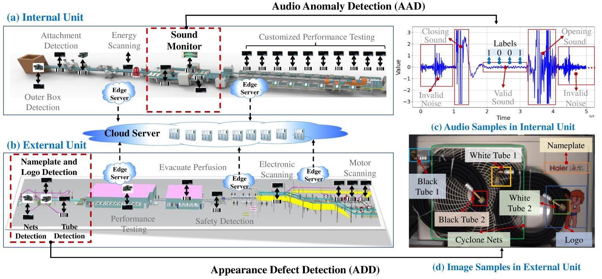
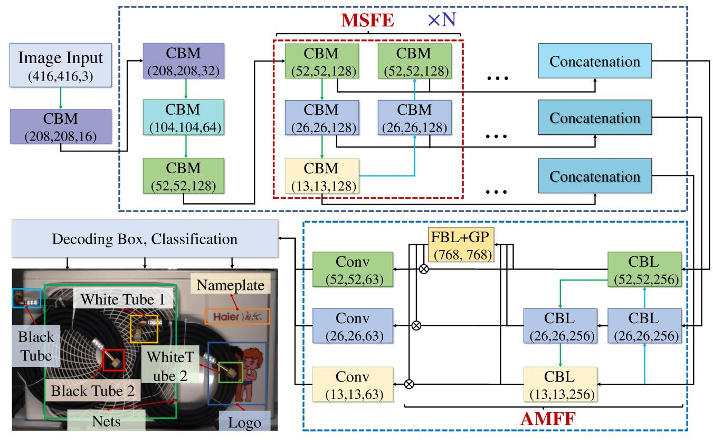
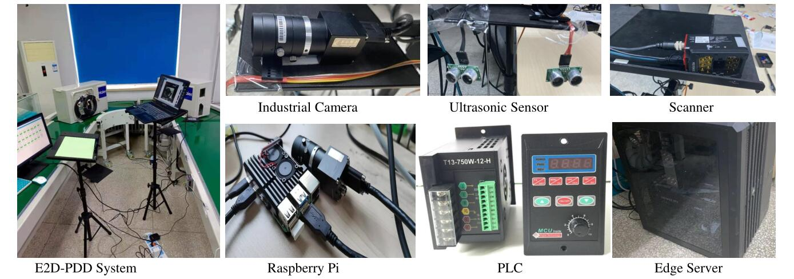
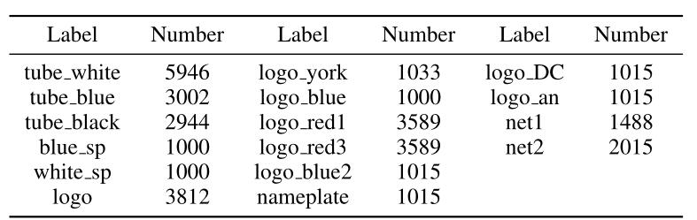
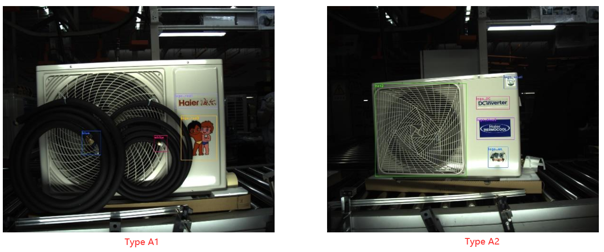
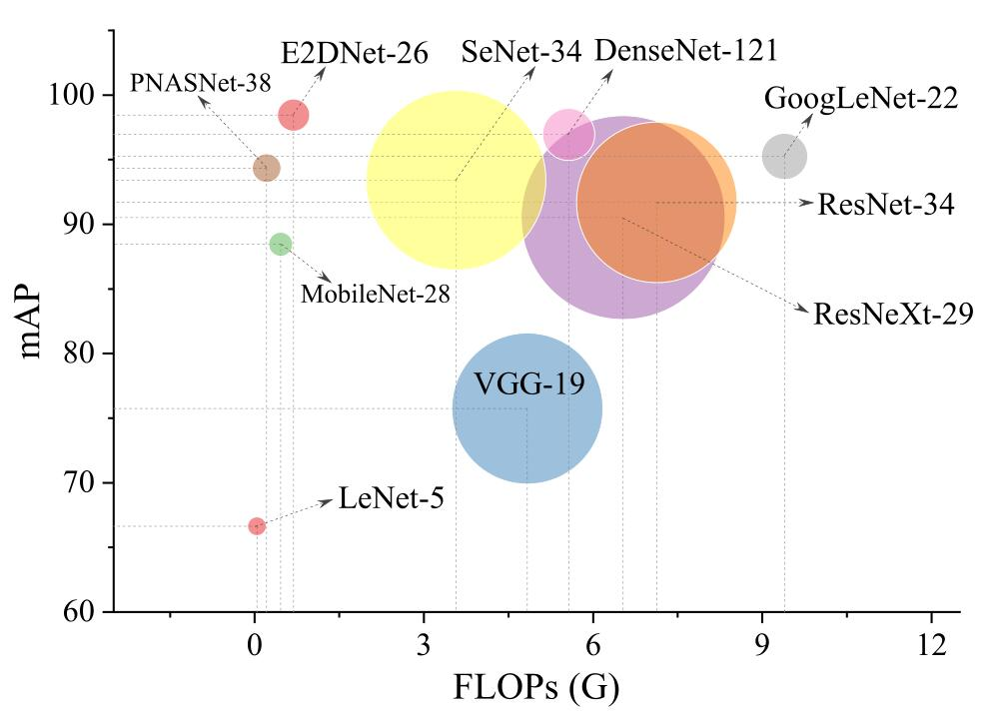
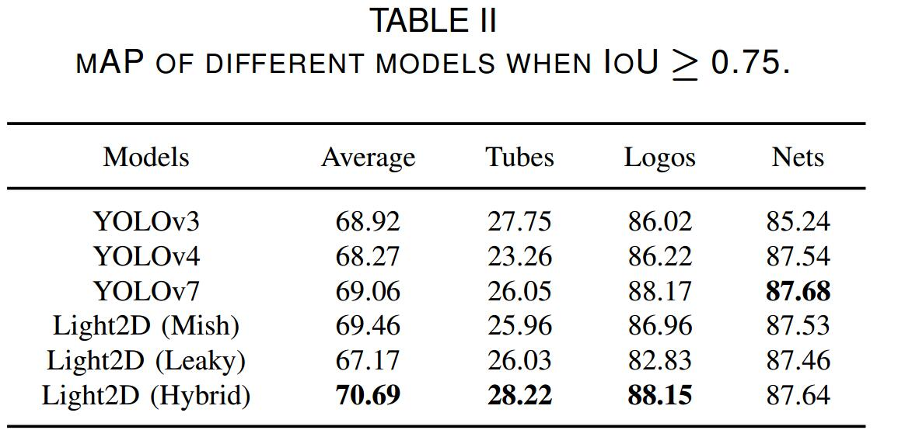
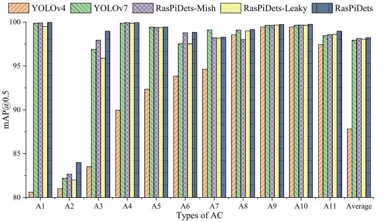
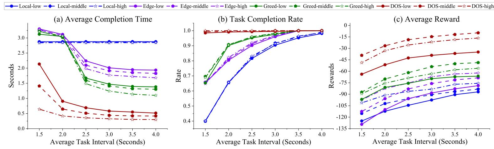

# RasPiDets: A Real-Time Defect Detection Method with End-Edge-Cloud Collaboration


## 1. Introductiion 

Product Defect Detection (PDD) exists in many processes of industrial product production, which is an important workflow to sort out unqualified products. We focus on the PDD problem at multiple production stages, each of which produces specific data types and requires strict product quality control. 
In this work, we developed a lightweight PDD (RasPiDets) method with end-edge-cloud collaboration to defect the detection of product in industrial scenarios. 

<div align=center></div>

Specifically, Audio Anomaly Detection (AAD) existed in Air Conditioner (AC) internal units and Appearance Defect Detection (ADD) raised in AC external units are a very important and time-consuming quality control process. 
This greatly restricts the beat of the assembly line, which in turn leads to a reduction in production efficiency. 
To solve this problem, we developed a lightweight PDD (RasPiDets) method with End-Edge-Cloud (EEC) collaboration to accelerate the detection speed of edge nodes.



**The main contributions are summarized as follows:**
  - An lightweight defect detection Network (RasPiDets) with cascaded U-Net architecture is proposed that can solve the different detection problems in a unified model.
  - A lightweight PDD (RasPiDets) method system with end-edge-cloud collaboration are proposed to accelerate the detection speed of edge nodes, which realizes the plug-and-play of edge nodes while improving the detection speed.
  - FFPDD offers a **1.2%** improvement in detection accuracy over current state-of-the-art (SOTA) models and an average **64%** reduction in detection time.
  - Two PDD datasets of AC manufacturing (SDU-Haier-AQD and SDU-Haier-ND) are open sourced to accelerate related research progress.

## 2. RasPiDets

Considering together with the \``where are the defects'' problem existing in image type, we propose a Easy-to-Deploy defect detection Network (RasPiDets) that can solve the \``what'' and \``where'' detection problems in a unified network. 

**The innovations of RasPiDets include:** 
- A cascaded U-Net architecture is designed to quickly obtain feature maps of various sizes; 
- The lightweight deep architecture can be easily obtained by stacking U-Nets;
- Numerous shortcut path is added between the feature maps in U-Nets to reduce model over-fitting；
- RasPiDets is a lightweight network architecture that can be deployed on Raspberry Pi.

<div align=center></div>

## 3. An easy starting instance

1) Configure Darknet environment to accelerate RasPiDets, the details of the configuration can refer to [this](https://github.com/AlexeyAB/darknet).
  
2) Make dataset directory like this:
    - train (directory)
      - xx1.jpg (image sample)
      - xx1.txt (description file)
      - xx2.jpg (image sample)
      - xx2.txt (description file)
      - ......

3) Run the following code for training,

```
   cd RasPiDets
```
```python
./darknet detector train ./dataconfigs/ok.data ./configs/RasPiDets.cfg ./configs/RasPiDets_best.weights
```
4) Run the following code for validation
```
./darknet detector valid ./dataconfigs/ok.data ./configs/RasPiDets.cfg ./configs/RasPiDets_best.weights
```

5) Run the following code for testing
```python
./darknet detector test ./dataconfigs/ok.data ./configs/RasPiDets.cfg ./configs/RasPiDets_best.weights
```

## 4. ACDO algorithm for End-Edge-Could Collaboration

An Actor-Critic based Dynamic Offloading (ACDO) is designed to reduce the overall delay of RasPiDets on end devices.
Ultrasonic sensors, scanners and cameras are used to obtain the location, type and appearance of AC, respectively. 
They are connected with Raspberry Pi, an end device deployed with RasPiDets, to form a closed-loop process of perception, decision-making and control. 
In this end-edge-cloud collaboration scenario, the cloud has abundant computing capabilities but is far away from the end devices, and the edge servers are relatively close to the end devices but need to be connected to the end device via 5G network. 

<div align=center></div>


## 5. PDD System Implementation

We built an assembly line for industrial production detection to implement the PDD system with end-edge-cloud collaboration. In this PDD system, Raspberry Pi (4B) is used as the edge node to connect end devices such as ultrasonic sensors, scanners and cameras to realize low-cost and flexible deployment of the PDD algorithm.
Subsequently, the edge nodes are connected to the cloud via 5G to offload and schedule PDD tasks to further improve the speed of the detection algorithm. 
This makes the deployment of PDD detection units in complex industrial scenarios with high convenience and low cost.
Finally, the negative detection results are sent to PLC to sort out the unqualified products. 



## 6. Open Source Datasets

### 1) AAD dataset
The initially sampled AAD data in AC internal unit is saved as `wav' files, and the sampling frequency of the audio signal is 48kHz. To efficiently utilize these audio files, the long piece of audio is splited into many frames and each of them is converted into the 2D spectrogram by SG-Gram algorithm. Therefore, the AAD dataset is a multi-label image detection dataset, which includes 562 training samples and 142 test samples. 

- We open-sourced the audio dataset with annotation files [here](https://ieee-dataport.org/documents/sdu-haier-nd-dataset-noise-detection).
- Alternatively, you can easily get the dataset by this [link](https://pan.baidu.com/s/1PPypTxRKZRpl3xOXghz-8A?pwd=f8ig).
- The detailed introduction document can be found [here](files/SDU-Haier-AAD-Dataset-Introduction.pdf).
<div align=center></div>


### 2) ADD dataset
The ADD dataset includes 9401 training samples and 1408 testing samples.
There are totally 11 types of this dataset, each type has about 1000 images. 
This dataset contains 16 classes of objects to be detected, and each type contains a different number of classes. 
The number of categories of the 16 detected objects is shown in the following table. 

<div align=center></div>

- We open-sourced 10,449 samples with annotation files [here](https://ieee-dataport.org/documents/sdu-haier-aqd-dataset-appearance-quality-detection).
- Alternatively, you can easily get the dataset by this [link](https://pan.baidu.com/s/11FO1P-MZ52RuBgwWM7pOQw?pwd=zxp1).
- The detailed introduction document can be found [here](files/SDU-Haier-ADD-Dataset-Introduction.pdf).

<div align=center></div>


## 7. Experiments 

### 1) AAD tasks
RasPiDets achieves the best performance and fast runing speed compared to other SOTA models, realizing
the best trade-off between performance and speed. 
As shown in following figure, the performance (mAP), runing speed (FLOPs) and model size (parameters, indicated by bubble size) comparisons of different SOTA models on AAD tasks. 

<div align=center></div>


### 2) ADD tasks

The average mAP of RasPiDets is much better than that of other lightweight object detection models. 
As shown in following figure,  mAP of different models when IoU ≥ 0.75.

<div align=center></div>

<div align=center></div>

## 8. Performance of ACDO Algorithms

AAD and ADD tasks with 3 priorities reach the lowest delay at different time intervals when ACDO is adopted. 

<div align=center></div>
