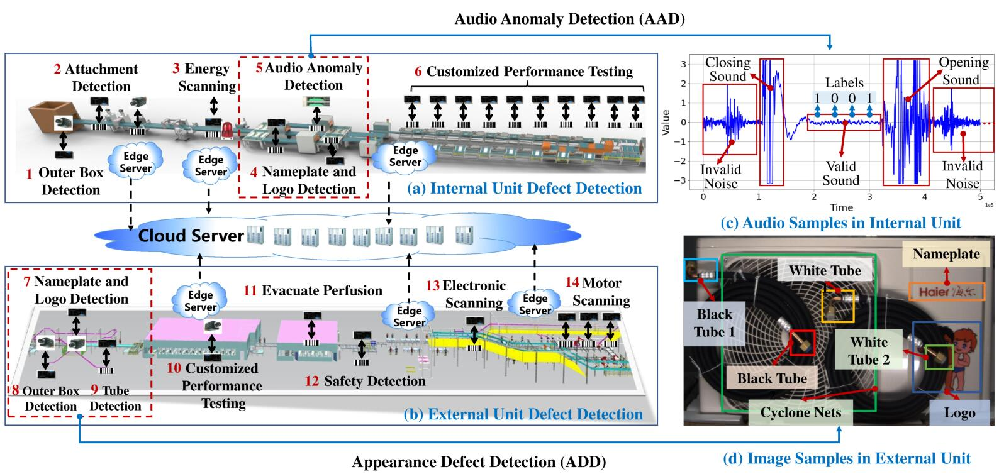
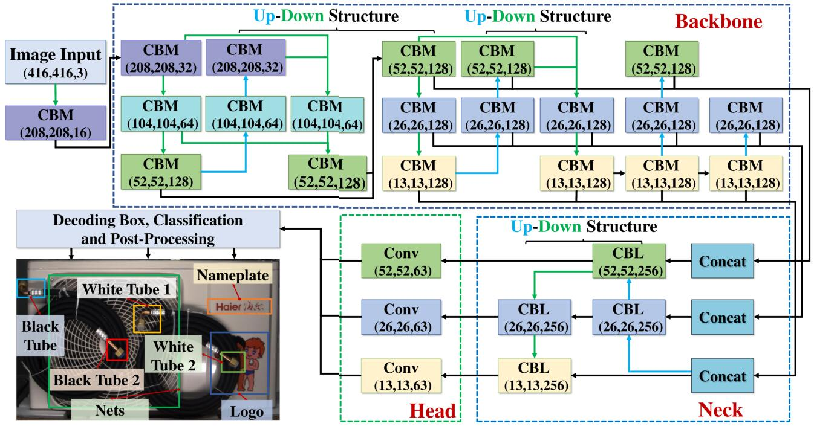

# An Easy-to-Deploy Product Defect Detection System with End-Edge-Cloud Collaboration

<iframe src="figs/video.mp4" scrolling="no" border="0" frameborder="no" framespacing="0" allowfullscreen="true"> </iframe>

## Introductiion

An Easy-to-Deploy Product Defect Detection system (E2D-PDD) with end-edge-cloud collaboration is developed to defect the detection of product in industrial scenarios. 

*The main contributions are summarized as follows:*
  - An Easy-to-Deploy lightweight defect detection Network (E2DNet) is proposed that can solve the different detection problems in a unified model.
  - An Easy-to-Deploy PDD (E2D-PDD) system with end-edge-cloud collaboration are proposed to accelerate the detection speed of edge nodes, which realizes the plug-and-play of edge nodes while improving the detection speed.
  - E2D-PDD offers a 5\% improvement in detection accuracy over current state-of-the-art (SOTA) models and an average 64\% reduction in detection time.
  - Two PDD datasets of AC manufacturing (SDU-Haier-AQD and SDU-Haier-ND) are open sourced to accelerate related research progress.

[//]: # ()   

 

## E2DNet

Considering together with the \``where are the defects'' problem existing in image type, we propose a Easy-to-Deploy defect detection Network (E2DNet) that can solve the \``what'' and \``where'' detection problems in a unified network. 

**The innovations of E2DNet include:** 
- A Up-Down (UD) module is designed to quickly obtain feature maps of various sizes; 
- The lightweight deep architecture can be easily obtained by stacking UD module;
- Numerous shortcut path is added between the feature maps in UD modules to reduce model over-fitting；
- E2DNet is a lightweight network architecture that can be deployed on Raspberry Pi. 

 

## ACDO algorithm for End-Edge-Could Collaboration

An Actor-Critic based Dynamic Offloading (ACDO) is designed to reduce the overall delay of E2DNet on end devices.
Ultrasonic sensors, scanners and cameras are used to obtain the location, type and appearance of AC, respectively. 
They are connected with Raspberry Pi, an end device deployed with E2DNet, to form a closed-loop process of perception, decision-making and control. 
In this end-edge-cloud collaboration scenario, the cloud has abundant computing capabilities but is far away from the end devices, and the edge servers are relatively close to the end devices but need to be connected to the end device via 5G network. 

## E2D-PDD System Implementation

We built an assembly line for industrial production detection to implement the E2D-PDD system with end-edge-cloud collaboration. In this E2D-PDD system, Raspberry Pi (4B) is used as the edge node to connect end devices such as ultrasonic sensors, scanners and cameras to realize low-cost and flexible deployment of the PDD algorithm.
Subsequently, the edge nodes are connected to the cloud via 5G to offload and schedule PDD tasks to further improve the speed of the detection algorithm. 
This makes the deployment of PDD detection units in complex industrial scenarios with high convenience and low cost.
Finally, the negative detection results are sent to PLC to sort out the unqualified products. 

<video id="video" controls="" preload="none" poster="corner">
      <source id="mp4" src="figs/video.mp4" type="video/mp4">
</video>

## Experiments

